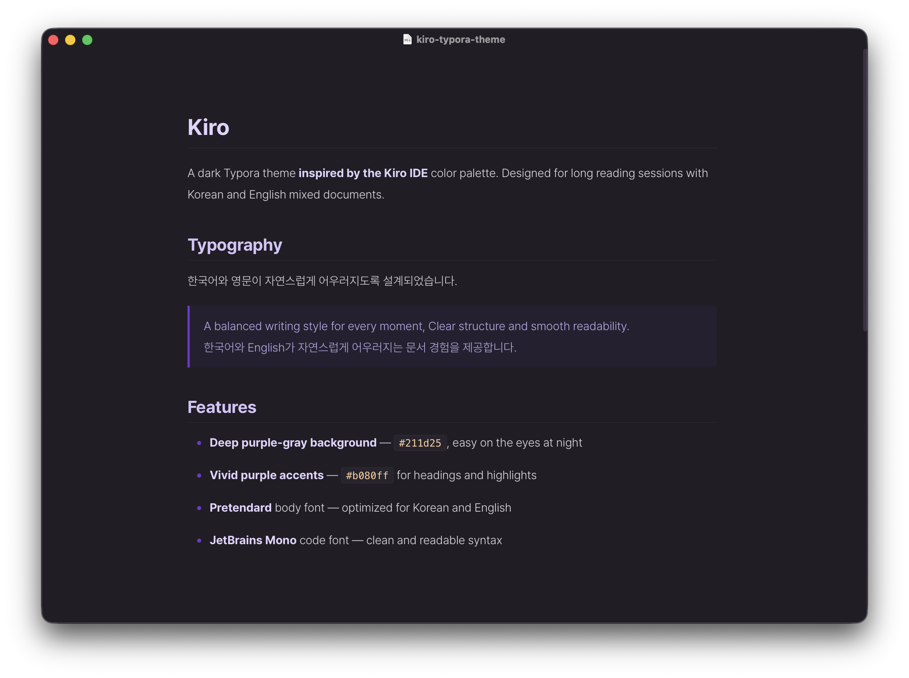
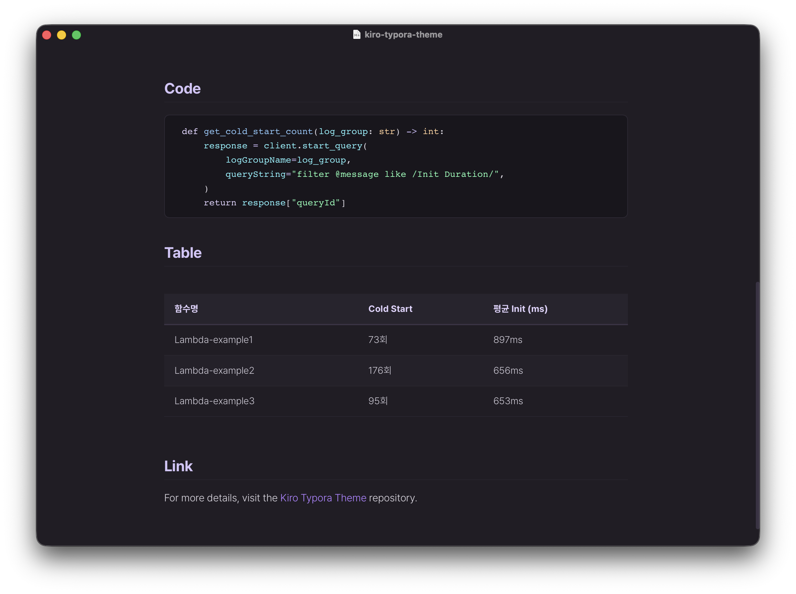

# Kiro Typora Theme

> **This theme is inspired by the [Kiro IDE](https://kiro.dev) color palette and is not affiliated with or endorsed by AWS.**

A dark Typora theme inspired by the [Kiro IDE](https://kiro.dev) color palette.
Deep purple-gray backgrounds with vivid purple accents, optimized for long reading sessions.

## Features

- Dark purple-gray background based on Kiro IDE palette
- Syntax highlighting with Kiro-style colors
- Optimized for Korean and English mixed documents
- Pretendard (body) + JetBrains Mono (code) font combination

## Installation

1. Download the latest release: [kiro-typora-theme-v1.0.0.zip](https://github.com/mooonu/typora-kiro-theme/releases/download/v1.0.0/kiro-typora-theme-v1.0.0.zip)
2. Unzip the file
3. Open Typora → Preferences → Appearance → Open Theme Folder
4. Copy `kiro.css` and `kiro/` folder into the theme directory
5. Restart Typora and select **Kiro** from the Themes menu

## Fonts

This theme uses the following fonts, bundled in the `kiro/` folder.

- [Pretendard](https://github.com/orioncactus/pretendard) — body text
- [JetBrains Mono](https://www.jetbrains.com/lp/mono/) — code blocks

## Tested On

- macOS
- Windows
